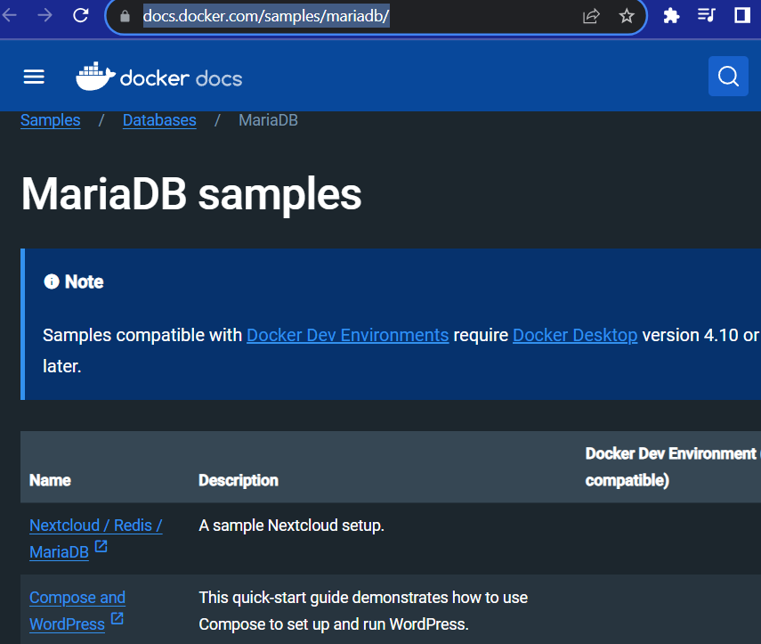
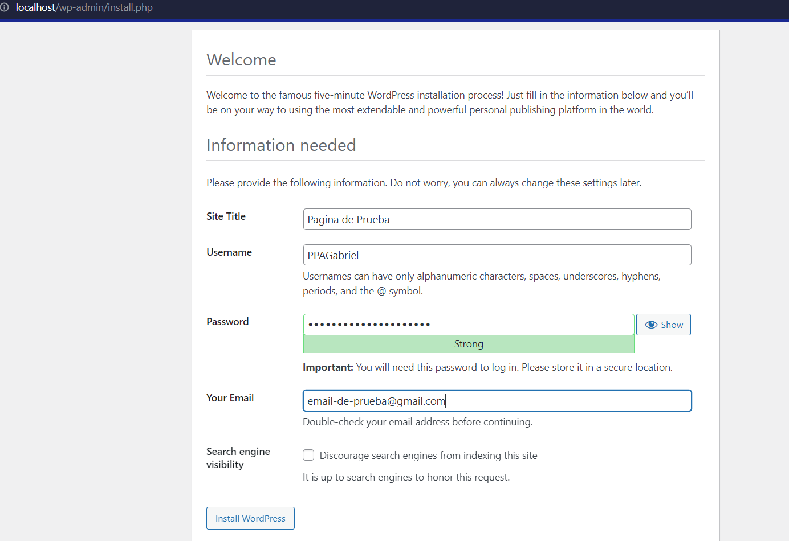
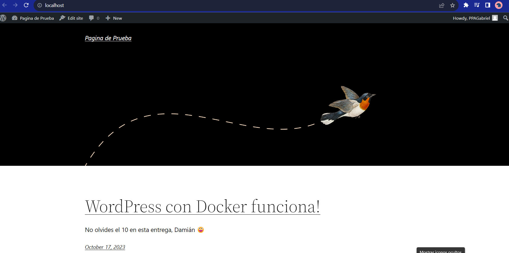

# Guía práctica: Wordpress con Docker

En esta oportunidad, instalamos el servicio de Wordpress con MariaDB empleando un contenedor Docker.

[Wordpress](https://www.webempresa.com/wordpress/que-es-wordpress.html) es un CMS (sistema de gestión de contenidos), que permite crear y administrar sitios web de manera fácil y sin conocimientos técnicos.

Los pasos para levantar este servicio, fueron los siguientes:

### 1. Crear un nuevo proyecto y añadir los archivos correspondientes

Una vez creado nuestro proyecto, añadimos un archivo llamado *"docker-compose.yml"*, herramienta indispensable para poder seguir avanzando en este proyecto.

> [!NOTE]
> Docker Compose es una herramienta dedicada a la orquestación local de dockers, definiendo y ejecutando aplicaciones Docker de varios contenedores de forma fácil y rápida.

### 2. Ubicar la imagen a emplear

Para este caso, se utilizó directamente [Docker Docs](https://docs.docker.com/samples/mariadb/), facilitando ya el código que debemos tener en nuestro formato .yml mediante un repositorio de Github.



### 3. Entender los parámetros del Docker Compose

Nuestro archivo tendrá el siguiente código:

``` dockerfile
services:
db:
# We use a mariadb image which supports both amd64 & arm64 architecture
image: mariadb:10.6.4-focal
# If you really want to use MySQL, uncomment the following line
#image: mysql:8.0.27
command: '--default-authentication-plugin=mysql_native_password'
volumes:
- db_data:/var/lib/mysql
environment:
- MYSQL_ROOT_PASSWORD=somewordpress
- MYSQL_DATABASE=wordpress
- MYSQL_USER=wordpress
- MYSQL_PASSWORD=wordpress
# para que estos contenedores puedan acceder a estos puertos
expose:
- 3306
- 33060
wordpress:
image: wordpress:latest
volumes:
- wp_data:/var/www/html
ports:
- 80:80
environment:
- WORDPRESS_DB_HOST=db # identificador del contenedor de arriba
- WORDPRESS_DB_USER=wordpress
- WORDPRESS_DB_PASSWORD=wordpress
- WORDPRESS_DB_NAME=wordpress
volumes:
db_data:
wp_data:
```

+ **db:** identifica el servicio que usaremos
+ **image:** la imagen deL contenedor
+ **command:** comandos que se desea emplear para la configuración del servicio
+  **volumes:** permite cambiar la ruta (el volumen también conocido), evitando el uso de la carpeta predeterminada
+ **environment:** configura el entorno, desde su nombre hasta la contraseña
+  **ports:** mapeo de los puertos del contenedor (puerto de la máquina:puerto del contenedor)

Cabe destacar que al finalizar la declaración de los servicios, declaramos los volumenes que estamos usando de cada uno y asi puedan ser ubicados.

### 4. Lanzar el servicio

Como se muestra en la siguiente imagen, es ejecutado el servicio y funciona correctamente


Para comprobar que Wordpress está en funcionamiento entramos a *"localhost:80"*, puerto que especificamos en el paso anterior para nuestro contenedor.



Finalmente, tenemos Wordpress en ejecución sin ningún tipo de problemas! :smile:




